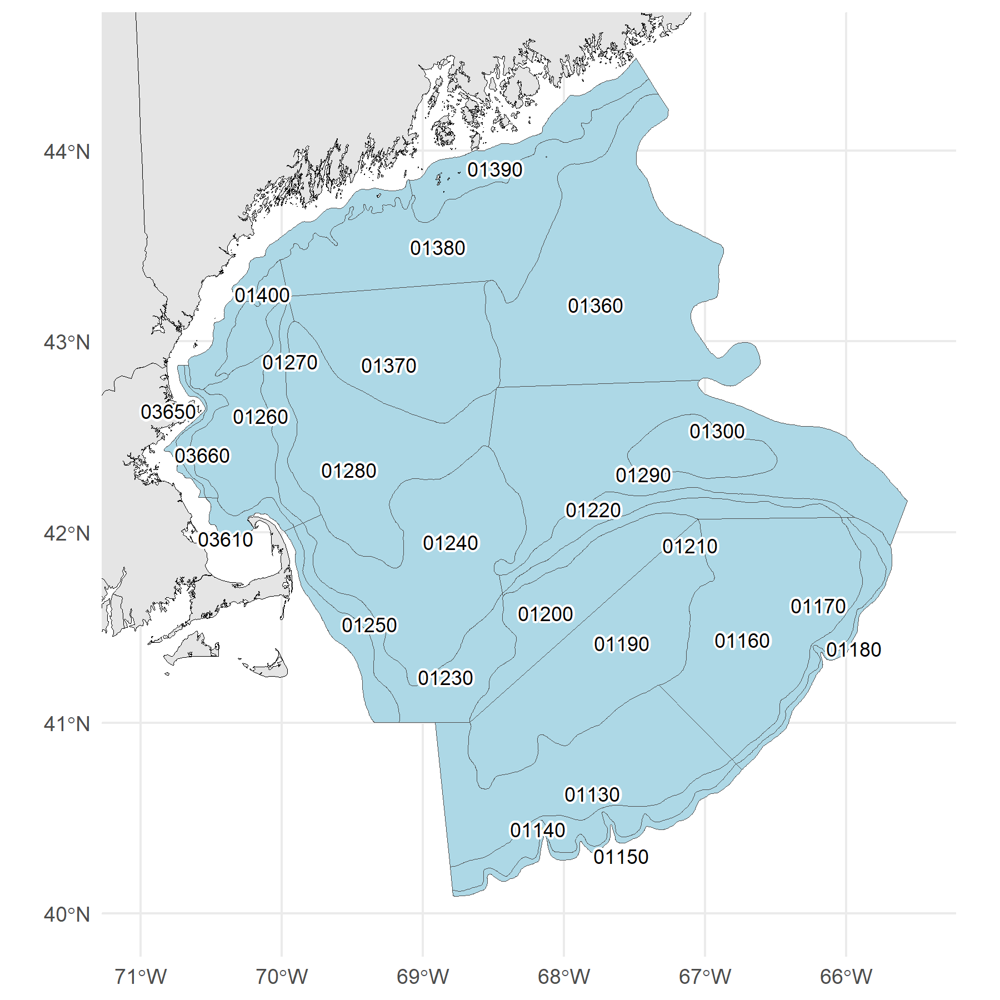
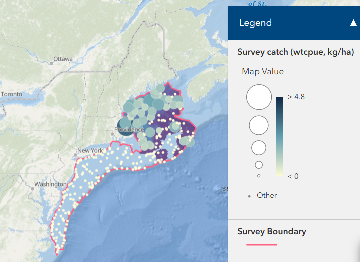
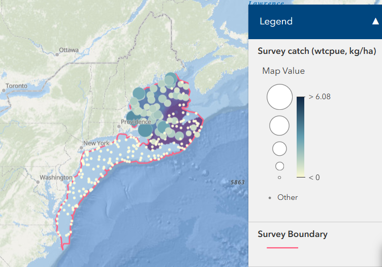

```{r setup}
knitr::opts_chunk$set(
  fig.height = 2.5,
  warning = FALSE,
  message = FALSE
)
```

# American Plaice

## Distribution Map
```{r}
#| out-width: "50%"
#| fig-align: center

```

## Socioeconomic Indicators 

Average price per pound, total landings (lbs), commercial revenue, and number of vessels are all below the long term mean, declining since 2020 or earlier. However, landings and revenue have rebounded slightly. Average revenue per vessel, which had been declining since the mid-2010s to a low in 2020, has risen well above the long-term mean after 2022. 

```{r plaice-socioeco}
plaice_socioeco <- here::here("01_inputs/AMERICANPLAICE_Commercial_Indicators_Master.csv")
data <- read.csv(plaice_socioeco)
```

### Average price per pound

```{r}
avgprice <- data |>
  dplyr::filter(INDICATOR_NAME == "AVGPRICE_AMERICANPLAICE_2025_DOLlb") 

NEesp2::plt_indicator(data = avgprice,
                      ar = 1/4,
                      include_trends = TRUE)  +
  ggplot2::scale_x_continuous(
    breaks = c(seq(1970, 2020, by = 10), 2025)) +
  ggplot2::theme(
    axis.text.x = ggplot2::element_text(angle = 45, hjust = 1)
  )
```

### Total commercial landings (pounds)

```{r}
landings <- data |>
  dplyr::filter(INDICATOR_NAME == "Commercial_AMERICANPLAICE_Landings_LBS") 

NEesp2::plt_indicator(data = landings,
                      ar = 1/4,
                      include_trends = FALSE) +
  ggplot2::geom_smooth(method = "lm", se = FALSE, color = "purple", linetype = "solid") +
  ggplot2::geom_line() +
  ggplot2::geom_point()  +
  ggplot2::scale_x_continuous(
    breaks = c(seq(1970, 2020, by = 10), 2025)) +
  ggplot2::theme(
    axis.text.x = ggplot2::element_text(angle = 45, hjust = 1)
  )
```

### Total commercial revenue

```{r}
totalrev <- data |>
  dplyr::filter(INDICATOR_NAME == "TOTALANNUALREV_AMERICANPLAICE_2025Dols") 

NEesp2::plt_indicator(data = totalrev,
                      ar = 1/4,
                      include_trends = FALSE)  +
  ggplot2::geom_smooth(method = "lm", se = FALSE, color = "purple", linetype = "solid") +
  ggplot2::geom_line() +
  ggplot2::geom_point()  +
  ggplot2::scale_x_continuous(
    breaks = c(seq(1970, 2020, by = 10), 2025)) +
  ggplot2::scale_y_continuous(labels = scales::label_scientific()) +
  ggplot2::theme(
    axis.text.x = ggplot2::element_text(angle = 45, hjust = 1)
  )
```

### Number of commercial vessels

```{r}
nvessels <- data |>
  dplyr::filter(INDICATOR_NAME == "N_Commercial_Vessels_Landing_AMERICANPLAICE") 

NEesp2::plt_indicator(data = nvessels,
                      ar = 1/4,
                      include_trends = FALSE)   +
  ggplot2::geom_smooth(method = "lm", se = FALSE, color = "purple", linetype = "solid") +
  ggplot2::geom_line() +
  ggplot2::geom_point()  +
  ggplot2::scale_x_continuous(
    breaks = c(seq(1970, 2020, by = 10), 2025)) +
  ggplot2::theme(
    axis.text.x = ggplot2::element_text(angle = 45, hjust = 1)
    )
```

### Average revenue per vessel ($USD2025)

```{r}
vesselrev <- data |>
  dplyr::filter(INDICATOR_NAME == "AVGVESREVperYr_AMERICANPLAICE_2025_DOLlb") 

NEesp2::plt_indicator(data = vesselrev,
                      ar = 1/4,
                      include_trends = TRUE)  +
  ggplot2::scale_x_continuous(
    breaks = c(seq(1970, 2020, by = 10), 2025)) +
  ggplot2::scale_y_continuous(labels = scales::label_scientific()) +
  ggplot2::theme(
    axis.text.x = ggplot2::element_text(angle = 45, hjust = 1)
  )
```

## Ecosystem Indicators

Indicators were identified in [Behan and Kerr 2022](https://repository.library.noaa.gov/view/noaa/66452).

### Mean Latitude

From DisMAP (1974-2024): "Shifts in the distributions are measured as change in latitude and change in depth. Capturing these shifts of particular stocks can have significant impacts on management decisions, particularly in a changing environment. For this module, data is harnessed from regional surveys* and filtered to include taxa that are sampled in at least 5% of tows in at least 3/4th of all survey years"

For plaice, the magnitude of mean latitude change is small, so it probably doesn't make sense to emphasize a directional shift.

#### Survey Catch and Center of Gravity (Latitude) in Fall
```{r}
#| out-width: "75%"
#| fig-align: center


dismap_fall <- read.csv(here::here('01_inputs/plaice_dismap_fall.csv')) |>
  dplyr::rename(DATA_VALUE = COG.Lat) |>
  dplyr::mutate(INDICATOR_NAME = "COG.Lat")

NEesp2::plt_indicator(data = dismap_fall,
                      ar = 1/4,
                      include_trends = TRUE)
```

#### Survey Catch and Center of Gravity (Latitude) in Spring
```{r}
#| out-width: "75%"
#| fig-align: center


dismap_spring <- read.csv(here::here('01_inputs/plaice_dismap_spring.csv')) |>
  dplyr::rename(DATA_VALUE = COG.Lat) |>
  dplyr::mutate(INDICATOR_NAME = "COG.Lat")

NEesp2::plt_indicator(data = dismap_spring,
                      ar = 1/4,
                      include_trends = TRUE)
```

### Bottom temperature

Water temperatures control spawning; optimum spawning temperatures range between 3-6°C but plaice can tolerate -0.5 to 13°C. Spawning occurs from March - June, peaking in April/May. Distribution appears to be regulated by warm summer and fall temperatures. 

From the 2022 ESP: "Bottom temperature anomaly is a significant factor influencing depth of occurrence, with plaice shifting deeper and a more northward distribution with increasing bottom temperature. Mean latitude (both fall and spring) has gradually shifted northward since the late 1990s and bottom temperature anomaly
was found to have a significant positive influence on the center of gravity of plaice in both fall and spring distribution models. Bottom temperature exhibited a significant, positive relationship on weight-at-age of plaice at age one (fall model), however, there was a negative relationship between WAA and bottom temperature at older ages when significant."

```{r plaice-bt-data}
url1 <- here::here("01_inputs/AMERICANPLAICE_hubert_bottomT.csv")
url2 <- here::here("01_inputs/AMERICANPLAICE_glorys_bottomT.csv")

bt_data <- read.csv(url1) |>
  dplyr::bind_rows(read.csv(url2))
```

#### SEASONAL BOTTOM TEMP (MAR - AUG)

As described in the 2022 working paper, March-August bottom temperature anomaly affects plaice recruitment. Much of the 2010s were warmer than the long term mean, with seasonal highs greater than 8°C and reaching 9°C in 2020, higher than the optimal spawning temperatures. The last few years have been around or below the long term mean, which may be beneficial for plaice recruitment. This data set does not yet include 2026.
```{r, eval = file.exists(url1) & file.exists(url2), results='asis'}
#| fig-width: 7
#| fig-align: center

seasonal_bt <- bt_data |>
  dplyr::filter(YEAR %in% 1970:2025) |>
  dplyr::filter(MONTH %in% 3:8) |>
  dplyr::group_by(YEAR) |>
  dplyr::summarize(DATA_VALUE = mean(DATA_VALUE, na.rm = TRUE)) |>
  dplyr::mutate(INDICATOR_NAME = "seasonal_bt")

NEesp2::plt_indicator(data = seasonal_bt,
                      ar = 1/4,
                      include_trends = TRUE) +
  ggplot2::scale_x_continuous(
    breaks = c(seq(1970, 2020, by = 10), 2025)) +
  ggplot2::theme(
    axis.text.x = ggplot2::element_text(angle = 45, hjust = 1)
  )
  
```

#### ANNUAL MEAN PRIOR TO FALL SURVEY = OCT(year-1) - SEPT

Annual bottom temp anomaly leading up to fall survey (October of year-1 to September of year 0) is positively correlated with the mean latitude where plaice are found in the fall and fall condition. There is a long-term increasing trend in annual bottom temperatures (Oct-Sept) since 1970, with highs above the long-term mean throughout much of the 2010s and early 2020s. Since 2023, annual mean temperatures prior to the fall survey have declined from recent highs and are near the long-term mean. An overall warming trend in bottom temperatures may eventually result in changes in plaice distribution and condition. This data set does not yet include 2026.

```{r, eval = file.exists(url1) & file.exists(url2), results='asis'}
#| fig-width: 7
#| fig-align: center

fall_bt <- bt_data |>
  dplyr::filter(YEAR %in% 1970:2025) |>
  dplyr::group_by(YEAR) |>
  dplyr::mutate(Season_Start_Year = ifelse(MONTH %in% c(1:8), YEAR - 1, YEAR)) |>
  dplyr::ungroup() |>
  dplyr::group_by(Season_Start_Year) |>
  dplyr::summarize(DATA_VALUE = mean(DATA_VALUE, na.rm = TRUE),
                   Days_Count = dplyr::n()) |> #daily value, how many days are included in the average
  dplyr::rename(YEAR = Season_Start_Year) |>
  dplyr::mutate(INDICATOR_NAME = "fall_bt")

NEesp2::plt_indicator(data = fall_bt,
                      ar = 1/4,
                      include_trends = TRUE)  +
  ggplot2::scale_x_continuous(
    breaks = c(seq(1970, 2020, by = 10), 2025)) +
  ggplot2::theme(
    axis.text.x = ggplot2::element_text(angle = 45, hjust = 1)
  ) 
```

#### ANNUAL MEAN PRIOR TO SPRING SURVEY = MAR(year-1) - FEB

Annual bottom temp anomaly leading up to spring survey (March-February) is positively correlated with the mean latitude where plaice are found in the spring. Annual temperatures (Mar-Feb) were above the long-term mean in the 2010s peaking 2020. The last few years have been near the long-term mean. 
```{r, eval = file.exists(url1) & file.exists(url2), results='asis'}
#| fig-width: 7
#| fig-align: center

spring_bt <- bt_data |>
  dplyr::filter(YEAR %in% 1970:2025) |>
  dplyr::group_by(YEAR) |>
  dplyr::mutate(Season_Start_Year = ifelse(MONTH %in% c(1:2), YEAR - 1, YEAR)) |>
  dplyr::ungroup() |>
  dplyr::group_by(Season_Start_Year) |>
  dplyr::summarize(DATA_VALUE = mean(DATA_VALUE, na.rm = TRUE),
                   Days_Count = dplyr::n()) |> #daily value, how many days are included in the average
  dplyr::rename(YEAR = Season_Start_Year) |>
  dplyr::mutate(INDICATOR_NAME = "spring_bt") 

NEesp2::plt_indicator(data = spring_bt,
                      ar = 1/4,
                      include_trends = TRUE)  +
  ggplot2::scale_x_continuous(
    breaks = c(seq(1970, 2020, by = 10), 2025)) +
  ggplot2::theme(
    axis.text.x = ggplot2::element_text(angle = 45, hjust = 1)
  )
```

### Sea Surface Temperature 

Sea surface temperature is an important consideration for plaice recruitment and egg and larval survival. The thermal limit for survival and incubation of American plaice eggs is 14°C.

#### SEASONAL = MAR - JUNE 

March-June SST anomaly affects plaice recruitment. Spring temperatures have hovered around 7-8°C since the early 1980s, however temperatures in the early 2020s exceeded the long-term mean. Seasonal temperatures have declined since 2022, which may be beneficial for plaice recruitment, however there is a long-term increasing trend in sea surface temperatures. 
```{r}
#| fig-width: 7
#| fig-align: center

seasonal_sst <- read.csv(here::here('01_inputs/AMERICANPLAICE_sst.csv')) |>
  dplyr::filter(YEAR >= 1970) |>
  dplyr::filter(MONTH %in% 3:6) |>
  dplyr::group_by(YEAR) |>
  dplyr::summarize(DATA_VALUE = mean(DATA_VALUE, na.rm = TRUE)) |>
  dplyr::mutate(INDICATOR_NAME = "seasonal_sst")

NEesp2::plt_indicator(data = seasonal_sst,
                      ar = 1/4,
                      include_trends = TRUE)  +
  ggplot2::scale_x_continuous(
    breaks = c(seq(1970, 2020, by = 10), 2026)) +
  ggplot2::theme(
    axis.text.x = ggplot2::element_text(angle = 45, hjust = 1)
  )
```


### Gulf Stream Index

Currents, changes in circulation patterns, and shelf-slope dynamics are responsible for egg and larval transport.

When the strength of the Labrador Current is weak, a higher proportion of warm water coming from the Gulf Stream enters the Gulf of Maine, increasing Gulf of Maine water temperatures. The position of the Gulf Stream has shifted northward and the Gulf of Maine has seen temperature warming rates much higher than that of the global average in recent decades.

From the working paper: "GSI was a significant driver of recruitment in the fall. GSI explained more deviance in weight-at-age trends at younger ages and tended to exhibit a positive relationship on WAA."

#### ANNUAL MEAN GULF STREAM POSITION PRIOR TO FALL SURVEY = OCT(year-1) - SEPT
The annual mean of the Gulf Stream position leading up to fall survey affects recruitment. There is an overall long-term increasing trend in the position of the Gulf Stream since 1970, with the Gulf Stream being further north than the long-term mean in the 2010s, which may be contributing to warmer water temperatures in the Gulf of Maine and affecting plaice recruitment. The Gulf Stream has been near to or south of the long-term mean since 2023.
```{r}
gsi <- ecodata::gsi |>
  tidyr::separate(Time, c("Year", "Month"), sep = "\\.") |>
  dplyr::mutate(Month = dplyr::if_else(Month == "1", "10", Month)) |> # has october as '1' instead of '10'
  dplyr::filter(Var == 'gulf stream index',
                Year >= 1970) |>
  dplyr::rename(INDICATOR_NAME = Var,
                YEAR = Year,
                MONTH = Month,
                DATA_VALUE = Value) |>
  dplyr::select(YEAR, MONTH, INDICATOR_NAME, DATA_VALUE) |>
  dplyr::mutate(YEAR = as.numeric(.data$YEAR)) |>
  dplyr::mutate(Season_Start_Year = ifelse(MONTH %in% c(1:8), YEAR - 1, YEAR)) |>
  dplyr::group_by(Season_Start_Year) |>
  dplyr::summarize(DATA_VALUE = mean(DATA_VALUE, na.rm = TRUE),
                   Months_Count = dplyr::n()) |>
  dplyr::rename(YEAR = Season_Start_Year) |>
  dplyr::mutate(INDICATOR_NAME = "gulf_stream_index")

NEesp2::plt_indicator(data = gsi,
                      ar = 1/4,
                      include_trends = TRUE)  +
  ggplot2::scale_x_continuous(
    breaks = c(seq(1970, 2020, by = 10), 2025)) +
  ggplot2::theme(
    axis.text.x = ggplot2::element_text(angle = 45, hjust = 1)
  )
```


### NAO Index

From working paper: "Reproductive rate (recruits per spawner) of American plaice is significantly related to temperature and the North Atlantic Oscillation, where greatest recruitment rates occur at extreme cold temperatures. NAO has a significant effect on depth of occurrence in the fall."


#### NAO 2 YEAR LAG
The North Atlantic Oscillation (NAO)  index is a measure of the strength and position of the westerly winds across the North Atlantic. Strong positive phases of the NAO tend to be associated with above-normal temperatures in the eastern United States. The NAO index has a 1-2 year lag effect on American plaice recruitment. The NAO index has remained near the long-term mean throughout much of the time series (since 1970), with a few years of extreme negative NAO values early 2010s and extreme positive NAO values in 2020.

NAO (6 month mean) was significantly related to mean latitude in the spring. 
```{r}
nao <- read.csv(here::here('01_inputs/nao_index.csv')) |>
  dplyr::mutate(yearly_nao = rowMeans(dplyr::across(Jan:Dec), na.rm = TRUE))|>
  dplyr::filter(Year >= 1970) |>
  dplyr::rename(YEAR = Year) |>
  dplyr::mutate(INDICATOR_NAME = "yearly_nao") |>
  dplyr::select(YEAR, yearly_nao, INDICATOR_NAME) |>
  dplyr::arrange(YEAR) |>
  dplyr::rename(DATA_VALUE = yearly_nao) 
  # dplyr::mutate(NAO_lag2 = dplyr::lag(yearly_nao, n = 2)) |>
  # dplyr::rename(DATA_VALUE = NAO_lag2)

NEesp2::plt_indicator(data = nao,
                      ar = 1/4,
                      include_trends = TRUE)  +
  ggplot2::scale_x_continuous(
    breaks = c(seq(1970, 2020, by = 10), 2026)) +
  ggplot2::theme(
    axis.text.x = ggplot2::element_text(angle = 45, hjust = 1)
  )
```


### AMO Index

From working paper:

  - AMO explained the most deviance in both fall and spring recruitment models. Recruits per spawner increased with increasing AMO values up to a point, but then declined. 
  - AMO was the most consistent significant variable across the age classes with a tendency for more variance explained in deviance of weight-at-age in older ages and a negative relationship with between AMO and WAA.
  - AMO had a negative correlation with mean latitude in fall bottom trawl surveys

AMO has been greater than +1 SD of the long term mean since 2020, indicating possible favorable conditions for recruitment for plaice.

AMO (short, unsmoothed) data from https://psl.noaa.gov/data/correlation/amon.us.data. Last updated January 2023.

#### AMO 6 months prior to fall survey (April-September)
6 months AMO prior to fall survey (Apr-Sept) affects recruitment and fall condition. There is a long-term increasing trend in the AMO index (Apr-Sept), with recent peaks in the early 2020s. The AMO index has been above the long-term mean since 2020. AMO values below 0 and above 0.25 are associated with lower recruitment, while values between approximately 0-0.25 are associated with higher recruitment (Behan and Kerr 2022, fig. 2). Recent AMO values are positive, with some being above the transition point of ~0.25, so impacts on recruitment may be mixed.
```{r}
fall_amo <- read.csv(here::here('01_inputs/unsmoothed_amo.csv')) |>
  dplyr::filter(Year >= 1970) |>
  dplyr::filter(Month %in% 4:9) |>
  dplyr::group_by(Year) |>
  dplyr::summarize(DATA_VALUE = mean(Value, na.rm = TRUE)) |>
  dplyr::rename(YEAR = Year) |>
  dplyr::mutate(INDICATOR_NAME = "fall_amo")

NEesp2::plt_indicator(data = fall_amo,
                      ar = 1/4,
                      include_trends = TRUE)  +
  ggplot2::scale_x_continuous(
    breaks = c(seq(1970, 2020, by = 10), 2022)) +
  ggplot2::theme(
    axis.text.x = ggplot2::element_text(angle = 45, hjust = 1)
  )
```

#### AMO 6 months prior to spring survey (September - February)
6 months AMO prior to spring survey (Sept-Feb) affects recruitment. There is a long-term increasing trend in the AMO index (Apr-Sept), with recent peaks in the 2023 and 2024. The AMO index has been above the long-term mean since 2020, which may be contributing to higher recruitment. Unlike the fall AMO, the impact of the spring AMO on recruitment does not become negative at higher values (Behan and Kerr 2022, fig. 3), so recent spring AMO values indicate favorable conditions for plaice recruitment.
```{r}
spring_amo <- read.csv(here::here('01_inputs/unsmoothed_amo.csv')) |>
  dplyr::filter(Year >= 1970) |>
  dplyr::filter(Month %in% c(9, 10, 11, 12, 1, 2)) |>
  dplyr::mutate(Season_Start_Year = ifelse(Month %in% c(1, 2), Year - 1, Year)) |>
  dplyr::group_by(Season_Start_Year) |>
  dplyr::summarize(DATA_VALUE = mean(Value, na.rm = TRUE),
                   Months_Count = dplyr::n()) |> # keeps track of how many months went into the average
  dplyr::rename(YEAR = Season_Start_Year) |>
  dplyr::mutate(INDICATOR_NAME = "spring_amo")

NEesp2::plt_indicator(data = spring_amo,
                      ar = 1/4,
                      include_trends = TRUE)  +
  ggplot2::scale_x_continuous(
    breaks = c(seq(1970, 2020, by = 10), 2022)) +
  ggplot2::theme(
    axis.text.x = ggplot2::element_text(angle = 45, hjust = 1)
  )
```

### Condition
Condition of American plaice across the Northeast Shelf exhibited lows in the 2000s to 2010, indicating thinner, lower-quality fish. Condition values have increased overall since 2010, with most recent years having neutral to good condition, and are experiencing fewer years of poor or below-average condition compared to lows in the 2000s. 

From ESP: "SSB had the most significant influence on mean condition, followed by annual bottom temperature anomaly, and a 6-month mean AMO variable. Plaice condition increased with increasing SSB and bottom temperature, but exhibited a curvilinear response to AMO."
```{r condition}
#| fig-width: 7
#| fig-height: 8
#| fig-align: center

data <- read.csv(here::here("03_outputs/plaice_condition.csv")) |>
  dplyr::group_by(Species, YEAR, INDICATOR_NAME) |>
  dplyr::summarise(
    DATA_VALUE = mean(DATA_VALUE, na.rm = TRUE),
    .groups = "drop"
  ) |>
  dplyr::mutate(EPU = "ALL")

NEesp2::plot_condition(data = data,
                       var = "American plaice", 
                       return = TRUE) +
  # ggplot2::facet_wrap(~EPU, ncol = 1) +
  ggplot2::theme(legend.position = "bottom") +
  ggplot2::ylab("Relative Condition")
```

## Key Takeaways

- The fishery is consolidating into fewer vessels, with fewer landings and lower revenue, but higher revenue per vessel.
- Recent cooling in bottom temperatures may be beneficial for plaice recruitment, but it is unclear how long this cooling will last.
- A positive trend in AMO may result in mixed-to-positive effects on recruits per spawner.

